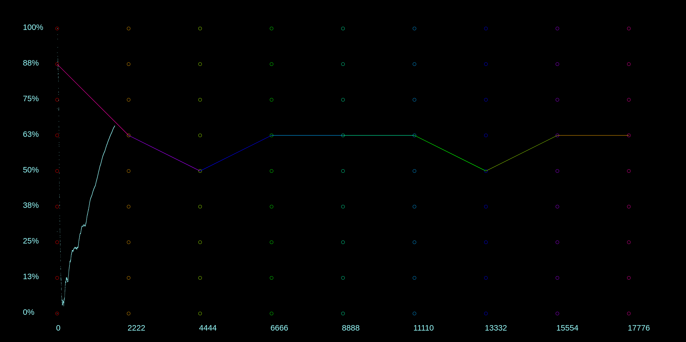

# Reinforcement Learning Path Finder
This program gives the user a choice between two reinforcement learning algorithms: Epsilon-Greedy and Lower Confidence Bound - this algorithm is then used to find the shortest path within a lattice. 

